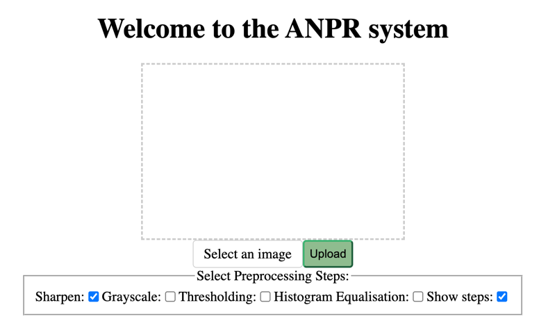
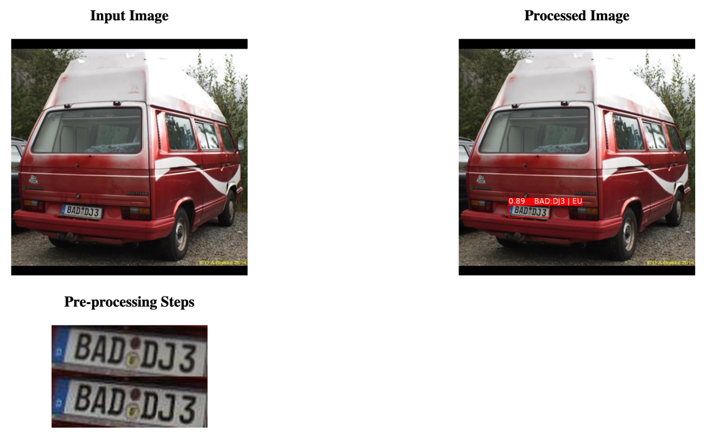

# ANPR system for European Plates

This project implements an ANPR system that reads number plates, and classifies
them as either European and Non-European. The system integrates Ultralytics
YOLOv8n to localise the number plate, MobileNetV2 to classify it, and
PaddleOCR to read the text. The classifier was trained according to the assumption
that 'a European plate must have a blue strip on the left side of it'. The system
hosted on a Flask backend.



# Instructions to run the system
To run the system, the following steps need to be followed:
- Clone the repository at:
```
https://github.com/JoeTCode/third-year-project
```
- Install the listed packages in the ```requirements.txt``` using:
```
pip install -r requirements.txt
```
- Change the absolute filepaths in the ```config.py``` file, 
below the comment:
```
FONT_PATH="/your_root_dir/ANPR/fonts/DejaVuSans.ttf"
YOLO_WEIGHT="/your_root_dir/ANPR/yolov8n/weights/run9_best.pt"
YOLO_SAVE_OCR_IMAGE_DIR='/your_root_dir/ANPR/backend/ocr-image'
MOBILENET_V2_WEIGHTS='/your_root_dir/ANPR/classifier/save_weights/mobilenet_v2_weights_1.pth'
```
- In the terminal, you must make sure that you are in the ```/backend/``` directory.
- To start the app, run the command: 
```
flask --app app run
```
- After navigating to the ```localhost``` link, you will be greeted with the User 
Interface.
- To test the system, upload and submit an image file, and the system will return a
processed image with the number plate predictions, detected text,
and classification overlaid onto it, as well as visualisations of any
pre-preprocessing steps that were selected.

